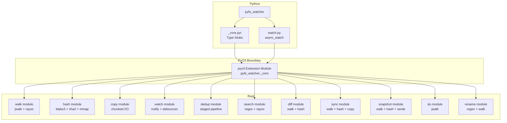
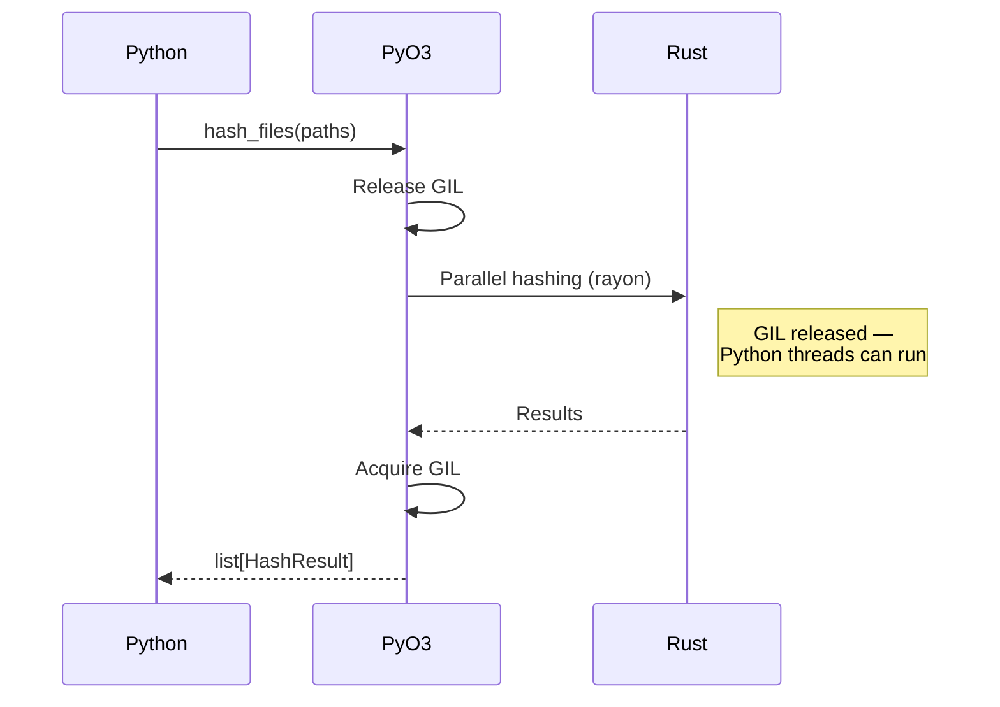
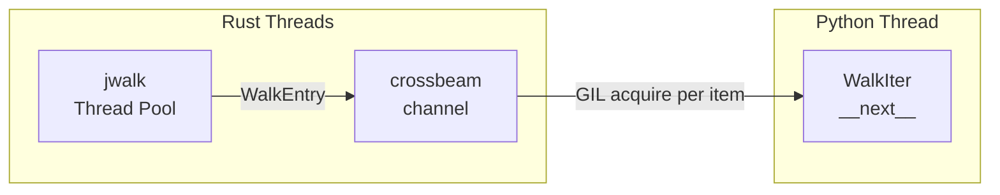
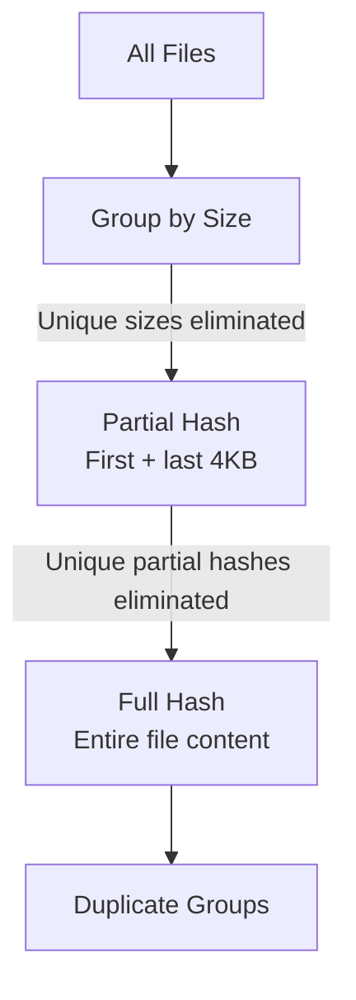

# Architecture

pyfs-watcher is a Python package with a Rust core, using PyO3 to bridge the two languages. This page explains the internal design decisions.

## System Overview



## GIL Management

The Global Interpreter Lock (GIL) is Python's mechanism for thread safety. Since Rust operations don't need the GIL, pyfs-watcher releases it during heavy computation using `py.allow_threads()`:



This means other Python threads can run while Rust is working, making pyfs-watcher a good citizen in multi-threaded Python applications.

**Exception:** The streaming `walk()` iterator acquires the GIL for each yielded item. For maximum throughput when you need all results, use `walk_collect()` which only acquires the GIL once.

---

## Streaming Walk Architecture

The `walk()` function uses a crossbeam channel to stream results from the parallel traversal engine:



- **jwalk** uses Rayon to traverse directories in parallel
- Entries are sent through a bounded crossbeam channel
- The Python `WalkIter.__next__()` receives one entry at a time, acquiring the GIL for each
- Early termination (breaking from the loop) drops the channel, cleanly stopping the traversal

---

## Memory-Mapped I/O

For file hashing, pyfs-watcher uses a size-based strategy:

| File Size | Strategy | Why |
|---|---|---|
| < 4 MB | Buffered reads | Lower overhead for small files |
| >= 4 MB | Memory-mapped I/O | OS handles page caching efficiently |

The 4 MB threshold is hardcoded based on benchmarking across SSDs and HDDs. Memory mapping avoids an extra copy from kernel space to user space, which becomes significant for large files.

---

## Dedup Pipeline

The deduplication pipeline is designed to minimize I/O by eliminating non-duplicates early:



**Stage 1 — Size grouping:** Files are grouped by size. Any file with a unique size is immediately excluded. This is a pure metadata operation (no I/O).

**Stage 2 — Partial hash:** For each size group, the first and last `partial_hash_size` bytes (default 4096) are read and hashed. Files with unique partial hashes are eliminated. This reads at most 8 KB per file.

**Stage 3 — Full hash:** Remaining candidates are fully hashed using the selected algorithm. Files with matching full hashes are confirmed duplicates.

Each stage uses Rayon for parallel processing.

---

## Rayon Thread Pools

CPU-bound operations (hashing, dedup) use Rayon thread pools:

- **Default:** Uses all available CPU cores
- **Configurable:** `max_workers` parameter limits the pool size
- **Per-call pools:** Each function call creates its own thread pool to avoid contention
- Rayon handles work-stealing and load balancing automatically

---

## Error Mapping

Rust errors are mapped to Python exceptions at the PyO3 boundary:

| Rust Error | Python Exception |
|---|---|
| `FsError::Walk(...)` | `WalkError` |
| `FsError::Hash(...)` | `HashError` |
| `FsError::Copy(...)` | `CopyError` |
| `FsError::Watch(...)` | `WatchError` |
| `FsError::Search(...)` | `SearchError` |
| `FsError::DirDiff(...)` | `DirDiffError` |
| `FsError::Sync(...)` | `SyncError` |
| `FsError::Snapshot(...)` | `SnapshotError` |
| `FsError::DiskUsage(...)` | `DiskUsageError` |
| `FsError::Rename(...)` | `RenameError` |
| `std::io::ErrorKind::NotFound` | `FileNotFoundError` |
| `std::io::ErrorKind::PermissionDenied` | `PermissionError` |

All custom exceptions inherit from `FsWatcherError`, which inherits from Python's `Exception`.

---

## Logging Bridge

pyfs-watcher uses `pyo3-log` to bridge Rust's `log` crate to Python's `logging` module. Enable debug logging to see internal operations:

```python
import logging
logging.basicConfig(level=logging.DEBUG)

import pyfs_watcher
# Rust-level log messages now appear in Python's logging output
```

---

## Key Dependencies

| Crate | Purpose |
|---|---|
| [pyo3](https://pyo3.rs) | Python ↔ Rust bindings |
| [jwalk](https://crates.io/crates/jwalk) | Parallel directory traversal |
| [blake3](https://crates.io/crates/blake3) | BLAKE3 hashing |
| [sha2](https://crates.io/crates/sha2) | SHA-256 hashing |
| [rayon](https://crates.io/crates/rayon) | Data parallelism |
| [notify](https://crates.io/crates/notify) | Cross-platform filesystem events |
| [notify-debouncer-full](https://crates.io/crates/notify-debouncer-full) | Event debouncing |
| [crossbeam-channel](https://crates.io/crates/crossbeam-channel) | Lock-free channels |
| [memmap2](https://crates.io/crates/memmap2) | Memory-mapped file I/O |
| [pyo3-log](https://crates.io/crates/pyo3-log) | Logging bridge |
| [regex](https://crates.io/crates/regex) | Content search and batch rename |
| [serde](https://crates.io/crates/serde) | Snapshot serialization |
| [serde_json](https://crates.io/crates/serde_json) | JSON snapshot format |
| [chrono](https://crates.io/crates/chrono) | Timestamp generation |
